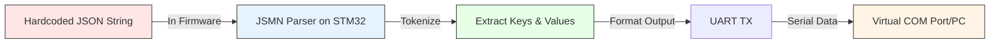

# Serial-JSON-Bridge

## Why This Exists

I built this for one reason: to understand how parsers actually work. How do you take a massive chunk of data, break it into pieces, and send it through a protocol without messing it up?

That's the core of everything in embedded systems.

## What I Got Out of It

- Actually understood driver architecture instead of just copying code
- Debugged a hard fault and learned what "memory constraints" really means
- Built something that doesn't fall apart when someone else tries to use it

## What It Does

Takes a hardcoded JSON string embedded in the STM32 firmware, parses it using JSMN on the microcontroller itself, extracts the key-value pairs, and transmits the parsed data back through UART to a virtual COM port. All on bare-metal hardware with fixed memory.

## How I Built This

**Step 1: Started Stupid Simple**  
Picked UART because it's the most basic protocol. No fancy stuff. Just understand how data actually moves.

**Step 2: Kept Driver and App Completely Separate**  
Driver handles all the hardware setup. App doesn't touch any of it. This separation is everything.

**Step 3: Actually Built a Parser**  
Took incoming data, broke it into tokens, sent it forward without losing anything. Sounds simple but it's not.

**Step 4: Tested on Real Hardware**  
Stopped simulating. Used actual boards. Reality hits different.

**Step 5: Hit a Wall and Learned**  
Stack overflow crashed everything. That one mistake taught me more than anything that worked smoothly. Understanding hardware limits is what separates embedded engineers from everyone else.

## The Architecture

**uart.c** → Interrupt-driven UART driver. Handles TX/RX byte-by-byte with state machines (IDLE, BUSY, ERROR).

**jsmn.c** → Lightweight JSON parser. No memory allocation. Just returns token indices pointing to the original string.

**jsonprocess.c** → Application logic. Takes tokens from JSMN, extracts key-value pairs, executes commands.

Send `{"user": "johndoe", "uid": 1000}` and watch it parse, extract, and respond.

## Performance

- **Flash Usage:** 1.8KB (1.4% of 128KB) - Extremely lean.
- **RAM Usage:** 452 bytes (1.3% of 36KB) - Very efficient.
- **ISR Execution:** ~5.56 µs worst-case.
- **CPU Load:** 0.53% at 9600 baud.

*See [PERFORMANCE.md](PERFORMANCE.md) for detailed analysis.*

## Testing

Validated through a 4-layer testing strategy:
1. **Manual Tests:** Basic TX/RX sanity checks.
2. **Unit Tests:** 9 automated tests for driver functions.
3. **Integration Tests:** 6 automated tests for state machines and concurrency.
4. **JSON Tests:** 8 automated tests for the parser logic.

*See [Test_README.md](Test_README.md) for the full test matrix and instructions.*

## What Actually Matters

**Memory constraints:** STM32 has limited stack. I overflowed it and got hard faults. Fixed buffers and careful indexing are non-negotiable.

**State machines:** UART runs on interrupts. One byte at a time. Miss a state and you lose data or hang.

**Separation:** When parsing logic mixed with driver code, debugging was impossible. Clean layers mean you can isolate problems.

**Error handling:** UART can fail (overrun, framing, noise). The driver catches these and provides recovery. Ignore them and your system dies silently.

## Tech Stack

STM32G0 | UART (9600 baud) | JSMN Parser | Bare-metal C

Tested on real hardware. No HAL. No simulation lies.

---

*Built to understand parsers. Debugged through crashes. That's how you actually learn embedded systems.*
