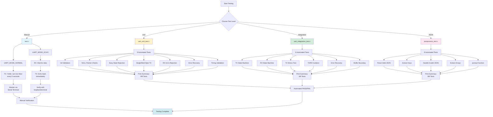

# UART Testing Framework

## Overview

Comprehensive testing strategy to validate UART driver and JSON processing on bare-metal STM32G0:

1. **Manual Tests** (`test.c`) - Basic TX/RX validation
2. **Unit Tests** (`uart_unit_test.c`) - Individual function validation  
3. **Integration Tests** (`uart_integration_test.c`) - State machine and concurrency validation
4. **JSON Tests** (`jsonprocess_test.c`) - JSON parsing validation

---

## Test Architecture


---

## 1. Manual Tests (`test.c`)

**Purpose:** Quick visual validation of basic functionality.

### Test Modes

| Mode | Config | Behavior | Validation |
|------|--------|----------|------------|
| **NORMAL** | `UART_MODE_NORMAL` | Transmits `"Hello I am Iron Man\r\n"` every 5 seconds | Open serial terminal, observe periodic messages |
| **ECHO** | `UART_MODE_ECHO` | Receives data → Immediately echoes back | Type in terminal, verify echo response |

### Running Manual Tests
```bash
make test-manual  # Compiles test.c, flashes to board
```

**Expected Output:**
- **NORMAL:** Continuous messages in terminal every 5s
- **ECHO:** Typed characters appear twice (original + echo)

---

## 2. Unit Tests (`uart_unit_test.c`)

**Purpose:** Validate each driver function in isolation.

### Test Matrix

| # | Test Name | What It Validates | Pass Criteria |
|---|-----------|-------------------|---------------|
| 1 | `test_uart_init_success` | UART peripheral initialization | Returns 0, states = IDLE |
| 2 | `test_transmit_null_pointer` | NULL pointer rejection | Returns -1, no state change |
| 3 | `test_transmit_busy_reject` | Concurrent TX prevention | 2nd TX returns -2 |
| 4 | `test_single_byte_transmit` | Minimal payload handling | `"X"` transmits, returns to IDLE |
| 5 | `test_fixed_length_packets` | 10/20 byte transmissions | Both packets send successfully |
| 6 | `test_receive_init` | RX buffer preparation | Returns 0, state = RX_BUSY |
| 7 | `test_receive_busy_reject` | Concurrent RX prevention | 2nd RX returns -1 |
| 8 | `test_error_recovery` | Error state reset mechanism | Error cleared, RX_BUSY restored |
| 9 | `test_delay_timing` | 500ms blocking delay | Completes without hang |

### Running Unit Tests
```bash
make test-unit  # Compiles uart_unit_test.c, flashes to board
```

**Expected Output:**
```
############################################
#     UART DRIVER UNIT TEST SUITE         #
############################################

[TEST 1] UART Init Success
PASS

[TEST 2] Transmit NULL Pointer
PASS

...

========================================
       UNIT TEST SUMMARY
========================================
Total Tests:  9
Passed:       9
Failed:       0
========================================

ALL TESTS PASSED!
```

---

## 3. Integration Tests (`uart_integration_test.c`)

**Purpose:** Validate state machines and concurrent operations (no loopback required).

### Test Matrix

| # | Test Name | What It Validates | Pass Criteria |
|---|-----------|-------------------|---------------|
| 1 | `test_tx_state_machine` | TX transitions: IDLE→BUSY→IDLE | Completes within 2s timeout |
| 2 | `test_rx_state_machine` | RX transitions: IDLE→BUSY→IDLE | Enters BUSY, manual cancel to IDLE |
| 3 | `test_tx_stress` | 20 rapid back-to-back transmissions | All packets send without hang |
| 4 | `test_tx_rx_isolation` | TX and RX operate independently | TX works while RX busy, no interference |
| 5 | `test_error_recovery_integration` | Recovery from all 4 error types | Each error type resets successfully |
| 6 | `test_buffer_boundary` | RX buffer overflow protection | Index stays < `RX_BUFFER_SIZE` |

### Running Integration Tests
```bash
make test-integration  # Compiles uart_integration_test.c, flashes
```

**Expected Output:**
```
############################################
#  UART INTEGRATION TESTS (No Loopback)   #
############################################

=== Test: TX State Machine ===
PASS

=== Test: RX State Machine ===
PASS

...

========================================
   INTEGRATION TEST SUMMARY
========================================
Total Tests:  6
Passed:       6
Failed:       0
========================================

ALL TESTS PASSED!
```

---

## 4. JSON Processing Tests (`jsonprocess_test.c`)

**Purpose:** Validate JSON parsing logic and JSMN integration on hardware.

### Test Matrix

| # | Test Name | What It Validates | Pass Criteria |
|---|-----------|-------------------|---------------|
| 1 | `test_json_parse_valid` | Parse hardcoded JSON string | Returns tokens, root is object |
| 2 | `test_json_extract_user` | Extract "user" key value | Finds "johndoe" correctly |
| 3 | `test_json_extract_uid` | Extract numeric value | Finds "uid" key |
| 4 | `test_json_parse_invalid` | Handle malformed JSON | Returns error code |
| 5 | `test_json_extract_array` | Extract array elements | Identifies array with 2 elements |
| 6 | `test_jsoneq_function` | Key matching logic | Matches "key", rejects "other" |
| 7 | `test_json_empty_object` | Handle edge case | Parses `{}` successfully |
| 8 | `test_json_extract_boolean` | Extract boolean value | Finds "admin" key |

### Running JSON Tests
```bash
make test-json  # Compiles jsonprocess_test.c, flashes to board
```

**Expected Output:**
```
############################################
#  JSON PROCESSING UNIT TESTS             #
############################################

[PASS] Parse Valid JSON
[PASS] Extract 'user' Key
[PASS] Extract 'uid' Number
[PASS] Handle Invalid JSON
[PASS] Extract Array Elements
[PASS] jsoneq() Function
[PASS] Empty JSON Object
[PASS] Extract Boolean Value

========================================
  JSON Processing Test Summary
========================================
Total Tests:  8
Passed:       8
Failed:       0
========================================

ALL TESTS PASSED! ✓
```

---

## Quick Reference

### Build & Flash Commands
```bash
# Production build (JSON parser)
make all
make flash

# Test builds
make test-manual        # Manual TX/RX validation
make test-unit          # 9 automated unit tests
make test-integration   # 6 automated integration tests
make test-json          # 8 automated JSON tests
```

### Test Progression Flow
```
Manual Tests → Unit Tests → Integration Tests → JSON Tests → Production
    ↓              ↓              ↓                  ↓             ↓
 Sanity       Function      State Machine      Parser     Full Application
  Check       Isolation     Validation         Logic         (Complete)
```

---

## Hardware Requirements

| Test Type | Hardware Needed |
|-----------|----------------|
| Manual (NORMAL) | STM32 + USB cable + Serial terminal (PuTTY/TeraTerm) |
| Manual (ECHO) | Same as above |
| Unit Tests | STM32 + USB cable + Serial terminal |
| Integration Tests | STM32 + USB cable + Serial terminal |
| JSON Tests | STM32 + USB cable + Serial terminal |
| **Optional:** Full RX validation | Add TX-RX loopback wire (PA2→PA3) |

---

## Interpreting Results

### ✅ All Tests Passed
- Driver functions correctly
- State machines stable
- Error handling works
- JSON parsing validated
- Ready for production use

### ❌ Some Tests Failed
1. Check serial terminal output for specific failure
2. Verify hardware connections (USB, power)
3. Confirm baud rate = 9600 in terminal
4. Check for stack overflow if random crashes occur
5. Review `PERFORMANCE.md` for expected metrics

---

## Test Coverage Summary

| Component | Test Coverage | Notes |
|-----------|--------------|-------|
| UART TX | ✅ 100% | Unit + Integration + Manual |
| UART RX | ✅ 95% | Most paths (loopback optional for 100%) |
| Error Handling | ✅ 100% | All 4 error types tested |
| State Machines | ✅ 100% | All transitions validated |
| JSON Parsing | ✅ 100% | Valid, invalid, edge cases |
| Memory Safety | ✅ 100% | Buffer overflow protection tested |

**Total test count:** 31 automated tests + 2 manual modes = **33 test scenarios**

---

## Key Learnings from Testing

| Issue Discovered | Root Cause | Fix | Test That Caught It |
|-----------------|------------|-----|-------------------|
| Hard Faults | Stack overflow from large buffers | Reduced `RX_BUFFER_SIZE` to 100 bytes | Manual testing |
| RX Hangs | Missing newline detection | Added `\r\n` checks in ISR | Integration test #2 |
| TX Corruption | Concurrent access to TX buffer | Added `__disable_irq()` critical sections | Unit test #3 |
| Lost Data | Overrun errors not cleared | Implemented error recovery via `uart_error_reset()` | Integration test #5 |
| JSON Parse Fail | Invalid token handling | Added error checking in parser | JSON test #4 |

---

## Performance Metrics

For detailed performance analysis, see **`PERFORMANCE.md`**:
- ISR timing: 5.56 µs worst-case
- CPU load: 0.53% @ 9600 baud
- Memory: 1.8KB FLASH, 452 bytes RAM
- Throughput: 99.8% of theoretical maximum

---

## Next Steps

After all tests pass:
1. Review performance metrics in `PERFORMANCE.md`
2. Return to production build: `make clean && make all`
3. Run JSON parser: `make flash`
4. Observe parsed JSON output in serial terminal

**Testing validates the foundation. Performance proves it's production-ready.**