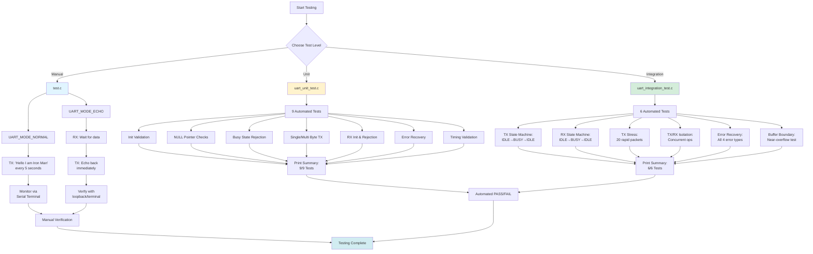

# UART Testing Framework

## Overview

Three-tier testing strategy to validate UART driver on bare-metal STM32G0:

1. **Manual Tests** (`test.c`) - Basic TX/RX validation
2. **Unit Tests** (`uart_unit_test.c`) - Individual function validation  
3. **Integration Tests** (`uart_integration_test.c`) - State machine and concurrency validation

---

## Test Architecture



---

## 1. Manual Tests (`test.c`)

**Purpose:** Quick visual validation of basic functionality.

### Test Modes

| Mode | Config | Behavior | Validation |
|------|--------|----------|------------|
| **NORMAL** | `UART_MODE_NORMAL` | Transmits `"Hello I am Iron Man\r\n"` every 5 seconds | Open serial terminal, observe periodic messages |
| **ECHO** | `UART_MODE_ECHO` | Receives data → Immediately echoes back | Type in terminal, verify echo response |

### Running Manual Tests

```bash
make test-manual  # Compiles test.c, flashes to board
```

**Expected Output:**
- **NORMAL:** Continuous messages in terminal every 5s
- **ECHO:** Typed characters appear twice (original + echo)

---

## 2. Unit Tests (`uart_unit_test.c`)

**Purpose:** Validate each driver function in isolation.

### Test Matrix

| # | Test Name | What It Validates | Pass Criteria |
|---|-----------|-------------------|---------------|
| 1 | `test_uart_init_success` | UART peripheral initialization | Returns 0, states = IDLE |
| 2 | `test_transmit_null_pointer` | NULL pointer rejection | Returns -1, no state change |
| 3 | `test_transmit_busy_reject` | Concurrent TX prevention | 2nd TX returns -2 |
| 4 | `test_single_byte_transmit` | Minimal payload handling | `"X"` transmits, returns to IDLE |
| 5 | `test_fixed_length_packets` | 10/20 byte transmissions | Both packets send successfully |
| 6 | `test_receive_init` | RX buffer preparation | Returns 0, state = RX_BUSY |
| 7 | `test_receive_busy_reject` | Concurrent RX prevention | 2nd RX returns -1 |
| 8 | `test_error_recovery` | Error state reset mechanism | Error cleared, RX_BUSY restored |
| 9 | `test_delay_timing` | 500ms blocking delay | Completes without hang |

### Running Unit Tests

```bash
make test-unit  # Compiles uart_unit_test.c, flashes to board
```

**Expected Output:**
```
[TEST 1] UART Init Success
PASS

[TEST 2] Transmit NULL Pointer
PASS

...

========================================
       UNIT TEST SUMMARY
========================================
Total Tests:  9
Passed:       9
Failed:       0
========================================

ALL TESTS PASSED!
```

---

## 3. Integration Tests (`uart_integration_test.c`)

**Purpose:** Validate state machines and concurrent operations (no loopback required).

### Test Matrix

| # | Test Name | What It Validates | Pass Criteria |
|---|-----------|-------------------|---------------|
| 1 | `test_tx_state_machine` | TX transitions: IDLE→BUSY→IDLE | Completes within 2s timeout |
| 2 | `test_rx_state_machine` | RX transitions: IDLE→BUSY→IDLE | Enters BUSY, manual cancel to IDLE |
| 3 | `test_tx_stress` | 20 rapid back-to-back transmissions | All packets send without hang |
| 4 | `test_tx_rx_isolation` | TX and RX operate independently | TX works while RX busy, no interference |
| 5 | `test_error_recovery_integration` | Recovery from all 4 error types | Each error type resets successfully |
| 6 | `test_buffer_boundary` | RX buffer overflow protection | Index stays < `RX_BUFFER_SIZE` |

### Running Integration Tests

```bash
make test-integration  # Compiles uart_integration_test.c, flashes
```

**Expected Output:**
```
=== Test: TX State Machine ===
PASS

=== Test: RX State Machine ===
PASS

...

========================================
   INTEGRATION TEST SUMMARY (No Loopback)
========================================
Total Tests:  6
Passed:       6
Failed:       0
========================================

ALL TESTS PASSED!
Note: These tests don't require loopback.
For full RX testing, use physical loopback.
```

---

## 4. HW Independent TDD Unit Tests (`uart_test.c`)

**Purpose:** Validate each driver function in isolation independent of HW connection.

### Test Matrix

|  # | Test Name | What It Validates | Pass Criteria |
|----|-----------|-------------------|---------------|
| 1  | `test_tx_sends_first_byte` | Verify first byte is written to TDR and indices update | USART_TDR == 'A',          g_tx_index == 1, g_tx_state == TX_BUSY |
| 2  | `test_tx_sends_multiple_bytes` | Verify sequential bytes are written for multi-byte payloads | Each loop: USART_TDR == data[i], g_tx_index == i+1 |
| 3  | `test_tx_completes_transmission` | Verify behavior when tx index already past end (disable TXEIE, clear buffer and set IDLE) | g_tx_state == IDLE, g_p_tx_buffer == NULL, TXEIE bit cleared |
| 4  | `test_rx_receives_single_byte` | Verify single RX byte stored into RX buffer when no error | err == UART_ERROR_NONE, g_p_rx_buffer[0] == 'X', g_rx_index == 1 |
| 5  | `test_rx_detects_newline` | Verify newline terminates message, NUL terminator added and RX disabled | g_p_rx_buffer[0] == '\n', g_p_rx_buffer[1] == '\0', g_rx_state == IDLE, RXNEIE cleared |
| 6  | `test_rx_detects_carriage_return` | Same as newline but for \r | g_p_rx_buffer[0] == '\r', g_p_rx_buffer[1] == '\0', g_rx_state == IDLE |
| 7  | `test_rx_buffer_overflow_protection` | Verify RX stops when buffer full (index == RX_BUFFER_SIZE - 1) | g_rx_state == IDLE, RXNEIE cleared |
| 8  | `test_has_error_detects_overrun` | Verify uart_has_error() detects overrun bit | uart_has_error() == TRUE when ORE bit set |
| 9  | `test_has_error_detects_overrun` | Verify uart_has_error() detects framing error | uart_has_error() == TRUE when FE bit set |
| 10 | `test_has_error_detects_framing` | Verify error handler clears RXNEIE, sets ERROR state, and writes to ICR for ORE | err == UART_ERROR_OVERRUN, g_rx_state == UART_STATE_ERROR, RXNEIE cleared, ICR has ORE bit set |
| 11 | `test_handle_error_clears_overrun` | Verify receiving a full message byte-by-byte ends in IDLE and stored string identical | g_rx_state == IDLE, strcmp(g_p_rx_buffer, "TEST\n") == 0, RXNEIE cleared |

### Running Unit Tests

```bash
make test-autoTDD  # Compiles uart_test.c, flashing to board is not required
```

**Expected Output:**
```
========================================
  UART Driver Unit Tests
========================================

TEST: TX sends first byte... PASS
TEST: TX sends multiple bytes... PASS
TEST: TX completes transmission... PASS
TEST: RX receives single byte... PASS
TEST: RX detects newline... PASS
TEST: RX detects carriage return... PASS
TEST: RX buffer overflow protection... PASS
TEST: RX receives complete message... PASS
TEST: Has error detects overrun... PASS
TEST: Has error detects framing error... PASS
TEST: Handle error clears overrun flag... PASS

========================================
  All Tests Passed! ✓
========================================
```

---

## Quick Reference

### Build & Flash Commands

```bash
# Production build (JSON parser)
make all
make flash

# Test builds
make test-manual        # Manual TX/RX validation
make test-unit          # 9 automated unit tests
make test-integration   # 6 automated integration tests
make test-autoTDD       # 11 automated HW independent TDD tests
```

### Test Progression Flow

```
Manual Tests → Unit Tests → Integration Tests → Production
    ↓              ↓              ↓                  ↓
 Sanity       Function      State Machine      Full Application
  Check       Isolation     Validation         (JSON Parser)
```

---

## Hardware Requirements

| Test Type | Hardware Needed |
|-----------|----------------|
| Manual (NORMAL) | STM32 + USB cable + Serial terminal (PuTTY/TeraTerm) |
| Manual (ECHO) | Same as above |
| Unit Tests | STM32 + USB cable + Serial terminal |
| Integration Tests | STM32 + USB cable + Serial terminal |
| **Optional:** Full RX validation | Add TX-RX loopback wire (PA2→PA3) |

---

## Interpreting Results

### ✅ All Tests Passed
- Driver functions correctly
- State machines stable
- Error handling works
- Ready for JSON integration

### ❌ Some Tests Failed
1. Check serial terminal output for specific failure
2. Verify hardware connections (USB, power)
3. Confirm baud rate = 9600 in terminal
4. Check for stack overflow if random crashes occur

---

## Key Learnings from Testing

| Issue Discovered | Root Cause | Fix |
|-----------------|------------|-----|
| Hard Faults | Stack overflow from large buffers | Reduced `RX_BUFFER_SIZE` to 100 bytes |
| RX Hangs | Missing newline detection | Added `\r\n` checks in ISR |
| TX Corruption | Concurrent access to TX buffer | Added `__disable_irq()` critical sections |
| Lost Data | Overrun errors not cleared | Implemented error recovery via `uart_error_reset()` |

---

## Next Steps

After all tests pass:
1. Return to production build: `make clean && make all`
2. Run JSON parser: `make flash`
3. Observe parsed JSON output in serial terminal

**Testing validates the foundation. Now build on it.**
